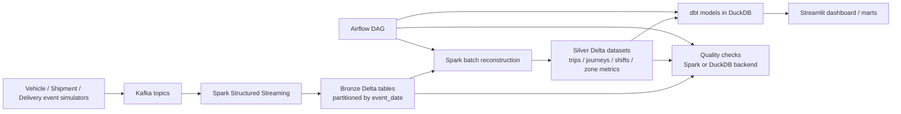

# Unified Logistics Data Platform: A Streaming + Batch Data Engineering Case Study

## TL;DR

This project is a portfolio-scale logistics data platform that models three operational domains: fleet telematics, shipment tracking, and last-mile delivery. It combines Kafka-style event ingestion, Spark Structured Streaming into a Bronze layer, Spark batch jobs into Silver datasets, a dbt project for warehouse-style marts, an Airflow DAG for orchestration, and a Streamlit dashboard for demo consumption. The strongest proven path today is a local sample-mode run: generate or normalize sample parquet, run the custom quality framework, and inspect Bronze/Silver outputs plus JSON reports. I verified two concrete proof points locally: `pytest -q` passed 77 tests, and the sample-mode quality run passed 31/31 checks on a normalized tiny demo dataset at `/tmp/logistics_demo_tiny`. The repo also contains stronger intended platform capabilities, including daily backfill hooks, checkpointed streaming sinks, and dbt model/test definitions, but the full Kafka -> Spark -> dbt -> Airflow path is not yet the release-proof demo because local dbt pathing and sample/source wiring still need cleanup.  
Evidence: `README.md`, `src/streaming/bronze_ingestion.py`, `src/batch/trip_reconstruction.py`, `src/batch/journey_reconstruction.py`, `src/batch/agent_shift_aggregation.py`, `dbt_logistics/dbt_project.yml`, `dags/logistics_pipeline.py`, `src/dashboard/app.py`, `tests/`, `/tmp/logistics_demo_tiny/quality_reports/quality_all_20260310_110123.json`

## Problem & Requirements

The platform is designed around three event-heavy logistics workflows. Fleet vehicles produce GPS positions and telemetry, shipment operations produce hub and lifecycle scan events, and delivery agents produce location updates plus delivery outcomes. The architecture implies mixed freshness requirements: streaming ingestion for raw events, daily batch reconstruction for operational aggregates, and hourly quality evaluation in orchestration config.  
Evidence: `README.md`, `src/domain/constants.py`, `src/simulators/vehicle_simulator.py`, `src/simulators/shipment_simulator.py`, `src/simulators/delivery_simulator.py`, `src/config.py`, `dags/logistics_pipeline.py`

Correctness constraints are explicit in code rather than left to convention. Bronze ingestion validates coordinates against India bounds, shipment and delivery events against accepted enums, and vehicle speed ranges against expected limits. The quality framework then enforces row-count, not-null, uniqueness, accepted-values, and numeric-range checks over Bronze and Silver datasets, while dbt model YAMLs add warehouse-layer tests such as `unique`, `not_null`, and `accepted_values`.  
Evidence: `src/streaming/bronze_ingestion.py`, `src/domain/constants.py`, `src/quality/quality_checks.py`, `dbt_logistics/models/staging/fleet/_fleet_models.yml`, `dbt_logistics/models/staging/shipment/_shipment_models.yml`, `dbt_logistics/models/staging/delivery/_delivery_models.yml`, `dbt_logistics/models/marts/_mart_models.yml`

The project also encodes operational requirements around recoverability and scheduling. Batch jobs accept an explicit `--date` for replay/backfill, Airflow computes a `processing_date` and passes it into each domain job, and the orchestrator constrains retries, runtime, and concurrency.  
Evidence: `src/batch/trip_reconstruction.py`, `src/batch/journey_reconstruction.py`, `src/batch/agent_shift_aggregation.py`, `dags/logistics_pipeline.py`, `src/config.py`

## Architecture Overview

At a high level, the intended runtime is: simulators publish to Kafka topics; Spark Structured Streaming ingests those topics into date-partitioned Bronze Delta tables; Spark batch jobs reconstruct trips, journeys, and shifts into Silver Delta datasets; dbt models build analytics-ready facts and dimensions in DuckDB; Airflow schedules the daily batch/model/quality flow; and Streamlit serves a dashboard that can fall back to sample data when the full stack is not running.  
Evidence: `README.md`, `src/simulators/run_all.py`, `src/streaming/bronze_ingestion.py`, `src/batch/`, `dbt_logistics/`, `dags/logistics_pipeline.py`, `src/dashboard/app.py`



For the verified local demo, I used a lighter path: sample parquet -> normalized demo root -> quality checks -> inspect Bronze/Silver outputs. That path proves ingest-like landing, transform outputs, validation, and publishable artifacts without requiring Kafka, Spark, or Airflow to be healthy locally.  
Evidence: `scripts/generate_sample_data.py`, `src/quality/quality_checks.py`, `/tmp/logistics_demo_tiny/bronze/vehicle_positions/sample_data.parquet`, `/tmp/logistics_demo_tiny/silver/fleet/trips/sample_data.parquet`, `/tmp/logistics_demo_tiny/quality_reports/quality_all_20260310_110123.json`

## Data Model

### Bronze Layer

The Bronze layer is organized around event topics rather than business facts. The streaming job declares explicit schemas for `vehicle_positions`, `vehicle_telemetry`, `shipment_events`, `agent_positions`, `delivery_events`, and `alerts`, and writes them partitioned by `event_date`. The staging dbt models then standardize timestamps, rename fields into analytics-friendly names, and add derived flags such as `is_valid_location`, `engine_temp_status`, `delivery_outcome`, and `alert_category`.  
Evidence: `src/streaming/bronze_ingestion.py`, `dbt_logistics/models/sources.yml`, `dbt_logistics/models/staging/fleet/stg_vehicle_positions.sql`, `dbt_logistics/models/staging/fleet/stg_vehicle_telemetry.sql`, `dbt_logistics/models/staging/fleet/stg_alerts.sql`, `dbt_logistics/models/staging/shipment/stg_shipment_events.sql`, `dbt_logistics/models/staging/delivery/stg_agent_positions.sql`, `dbt_logistics/models/staging/delivery/stg_delivery_events.sql`

| Dataset | Intended grain | Partition | Key fields |
|---|---|---|---|
| `bronze/vehicle_positions` | one row per vehicle GPS event | `event_date` | `event_id`, `vehicle_id`, `timestamp`, `latitude`, `longitude`, `speed_kmh` |
| `bronze/vehicle_telemetry` | one row per telemetry reading | `event_date` | `event_id`, `vehicle_id`, `engine_rpm`, `engine_temp_c`, `fuel_level_pct` |
| `bronze/shipment_events` | one row per shipment status/scan event | `event_date` | `event_id`, `shipment_id`, `event_type`, `hub_id`, `promised_delivery` |
| `bronze/agent_positions` | one row per agent GPS event | `event_date` | `event_id`, `agent_id`, `zone_id`, `latitude`, `longitude`, `status` |
| `bronze/delivery_events` | one row per delivery attempt/result | `event_date` | `event_id`, `agent_id`, `order_id`, `shipment_id`, `event_type` |
| `bronze/alerts` | one row per alert event | `event_date` | `event_id`, `event_type`, `severity`, `vehicle_id`, `driver_id` |

Evidence: `src/streaming/bronze_ingestion.py`, `dbt_logistics/models/sources.yml`

### Silver Layer

The Silver layer is built by Spark batch jobs and captures reconstructed business entities rather than raw events. `trip_reconstruction.py` produces one row per reconstructed vehicle trip, `journey_reconstruction.py` produces shipment journeys plus hub dwell metrics, and `agent_shift_aggregation.py` produces one row per agent per day plus zone-level daily metrics. Each main output is partitioned by its business date.  
Evidence: `src/batch/trip_reconstruction.py`, `src/batch/journey_reconstruction.py`, `src/batch/agent_shift_aggregation.py`

| Dataset | Grain | Partition | Representative derived columns |
|---|---|---|---|
| `silver/fleet/trips` | one row per reconstructed trip | `trip_date` | `total_distance_km`, `trip_duration_minutes`, `route_efficiency`, `trip_type` |
| `silver/shipment/journeys` | one row per shipment journey | `journey_date` | `journey_duration_hours`, `sla_status`, `journey_outcome`, `stuck_incidents` |
| `silver/shipment/hub_dwell` | one row per shipment-hub pair | none declared | `hub_dwell_hours`, `is_bottleneck` |
| `silver/delivery/agent_shifts` | one row per agent-day | `shift_date` | `deliveries_per_hour`, `delivery_success_rate`, `zone_rank` |
| `silver/delivery/zone_performance` | one row per zone-day | `event_date` | `avg_success_rate`, `total_deliveries`, `zone_performance_rank` |

Evidence: `src/batch/trip_reconstruction.py`, `src/batch/journey_reconstruction.py`, `src/batch/agent_shift_aggregation.py`

### Warehouse / Mart Layer

The dbt project defines a warehouse-style semantic layer on top of the operational data. Common dimensions include `dim_time` and `dim_hubs`, while facts include `fct_trips`, `fct_driver_performance`, `fct_shipments`, `fct_hub_daily`, `fct_agent_daily`, and `fct_zone_daily`. The fact models declare grain in comments, generate surrogate keys with `dbt_utils.generate_surrogate_key`, and preserve a `dbt_loaded_at` timestamp for run metadata.  
Evidence: `dbt_logistics/dbt_project.yml`, `dbt_logistics/packages.yml`, `dbt_logistics/models/marts/common/dim_time.sql`, `dbt_logistics/models/marts/common/dim_hubs.sql`, `dbt_logistics/models/marts/fleet/fct_trips.sql`, `dbt_logistics/models/marts/fleet/fct_driver_performance.sql`, `dbt_logistics/models/marts/shipment/fct_shipments.sql`, `dbt_logistics/models/marts/shipment/fct_hub_daily.sql`, `dbt_logistics/models/marts/delivery/fct_agent_daily.sql`, `dbt_logistics/models/marts/delivery/fct_zone_daily.sql`

## Pipeline Stages

### 1. Ingest

The project uses simulator modules as its source connectors. Each simulator generates domain-specific event payloads and publishes them to Kafka topics through a shared `BaseSimulator` producer wrapper. The Bronze ingestion job subscribes to those topics, parses JSON with fixed schemas, adds ingestion metadata, validates coordinates or accepted values where appropriate, and writes append-mode Delta outputs with per-topic checkpoint directories.  
Evidence: `src/simulators/base.py`, `src/simulators/run_all.py`, `src/simulators/vehicle_simulator.py`, `src/simulators/shipment_simulator.py`, `src/simulators/delivery_simulator.py`, `src/streaming/bronze_ingestion.py`

### 2. Transform

Three Spark batch jobs reconstruct higher-value entities from event streams. Trip reconstruction identifies movement boundaries from time gaps and state changes, journey reconstruction sequences shipment events and computes SLA/bottleneck features, and agent shift aggregation combines location and delivery outcomes into per-agent daily performance metrics.  
Evidence: `src/batch/trip_reconstruction.py`, `src/batch/journey_reconstruction.py`, `src/batch/agent_shift_aggregation.py`, `src/utils/spark_geo.py`

The dbt layer then standardizes and enriches those datasets into analytics-ready marts, including daily driver performance, shipment facts joined to hub metadata, and zone/agent daily delivery facts.  
Evidence: `dbt_logistics/models/intermediate/fleet/int_driver_daily_metrics.sql`, `dbt_logistics/models/intermediate/fleet/int_vehicle_trips.sql`, `dbt_logistics/models/intermediate/shipment/int_shipment_journeys.sql`, `dbt_logistics/models/intermediate/shipment/int_hub_throughput.sql`, `dbt_logistics/models/intermediate/delivery/int_agent_shifts.sql`, `dbt_logistics/models/marts/`

### 3. Quality

The quality layer is implemented as a reusable Python framework rather than a notebook script. It supports both Spark and DuckDB execution backends, caches repeated reads, returns structured pass/fail payloads, and writes a timestamped JSON report to disk. A second quality layer exists in dbt via schema tests and `store_failures: true`.  
Evidence: `src/quality/quality_checks.py`, `dbt_logistics/dbt_project.yml`, `dbt_logistics/models/staging/`, `dbt_logistics/models/marts/_mart_models.yml`

### 4. Publish

The primary publish surface in the repo is the Streamlit dashboard. It reads Bronze/Silver parquet directly, computes KPIs and visualizations, and can fall back to pre-generated sample data when live pipeline outputs are absent. In the intended full stack, dbt marts in DuckDB would also serve as a publishable analytics layer.  
Evidence: `src/dashboard/app.py`, `scripts/generate_sample_data.py`, `dbt_logistics/profiles.yml`

## Reliability

The streaming job is restart-aware. Each topic write uses a checkpoint directory, reads from `startingOffsets=earliest`, and sets `failOnDataLoss=false`, which is a pragmatic stance for bootstrap/replay and broker retention gaps. That combination supports recoverability, but it does not by itself prove exactly-once delivery semantics.  
Evidence: `src/streaming/bronze_ingestion.py`

The batch layer is explicitly backfill-friendly. All three domain jobs accept a `--date` argument, filter on partition-like date columns, and Airflow computes a prior-day `processing_date` and injects it into each task. This is a strong design choice for replayability and incremental correction workflows.  
Evidence: `src/batch/trip_reconstruction.py`, `src/batch/journey_reconstruction.py`, `src/batch/agent_shift_aggregation.py`, `dags/logistics_pipeline.py`

Retries and time-bounded execution are encoded in orchestration and producer code. Airflow sets retries, retry delay, timeout, and single-active-run behavior, while Kafka producers are configured with `acks="all"` and client retries. The simulator orchestrator also stops all modules if one fails, which avoids silent partial-domain generation.  
Evidence: `dags/logistics_pipeline.py`, `src/simulators/base.py`, `src/simulators/run_all.py`, `tests/unit/test_orchestrator.py`

I did not find watermarking, stream-side deduplication, or an explicit merge/upsert strategy in the Structured Streaming job. Today I would describe the raw ingestion contract as checkpointed append with replay tolerance, not as a hardened exactly-once design.  
Evidence: `src/streaming/bronze_ingestion.py`

## Data Quality

The custom checker covers multiple contract classes: minimum row count, not-null columns, uniqueness, accepted categorical values, and numeric ranges. It also standardizes failure handling by returning machine-readable error payloads that can be logged or stored.  
Evidence: `src/quality/quality_checks.py`, `tests/unit/test_quality_checks.py`

The nicest engineering decision here is portability. The same quality suite can read Delta through Spark or parquet through DuckDB, which means local smoke tests can run without a full Spark cluster. That portability is reinforced by an integration test that executes the checker against sample data and verifies report generation.  
Evidence: `src/quality/quality_checks.py`, `tests/integration/test_quality_pipeline_integration.py`

I verified the quality layer locally on a tiny normalized demo dataset. The run produced a report at `/tmp/logistics_demo_tiny/quality_reports/quality_all_20260310_110123.json` with `31` total checks and `31` passing checks. I also verified that the unmodified repo sample path is not fully aligned with the checker: `/tmp/logistics_quality_check/quality_all_20260310_102414.json` recorded failures caused by a missing `agent_positions` sample path and a trips schema mismatch. That caveat is worth calling out in a portfolio write-up because it distinguishes design intent from release readiness.  
Evidence: `/tmp/logistics_demo_tiny/quality_reports/quality_all_20260310_110123.json`, `/tmp/logistics_quality_check/quality_all_20260310_102414.json`, `src/quality/quality_checks.py`

## Performance Decisions

Storage and compute choices are pragmatic for a portfolio build. The runtime jobs target Delta Lake for Bronze and Silver writes, the dashboard and quality layer can consume parquet directly, and the dbt project targets DuckDB for lightweight analytics. Together, those choices keep local iteration fast while still demonstrating lakehouse-style patterns.  
Evidence: `src/streaming/bronze_ingestion.py`, `src/batch/trip_reconstruction.py`, `src/batch/journey_reconstruction.py`, `src/batch/agent_shift_aggregation.py`, `src/dashboard/app.py`, `src/quality/quality_checks.py`, `dbt_logistics/profiles.yml`

Spark sessions are tuned for small local runs by enabling adaptive execution and reducing shuffle partitions to `8`. The batch jobs also cache expensive outputs with `MEMORY_AND_DISK`, and the quality framework caches both Spark and DuckDB reads to avoid redundant scans.  
Evidence: `src/config.py`, `src/streaming/bronze_ingestion.py`, `src/batch/trip_reconstruction.py`, `src/batch/journey_reconstruction.py`, `src/batch/agent_shift_aggregation.py`, `src/quality/quality_checks.py`

Geospatial computation stays inside Spark SQL expressions instead of Python UDFs. The shared `haversine_distance_km_expr` helper is reused in trip and agent calculations, which is a good scale-aware decision because it preserves optimizer visibility and avoids Python serialization overhead.  
Evidence: `src/utils/spark_geo.py`, `src/batch/trip_reconstruction.py`, `src/batch/agent_shift_aggregation.py`

The Kafka producers also use micro-batching knobs such as `batch_size` and `linger_ms`, which is a smaller but still credible signal that throughput behavior was considered even in the source simulator layer.  
Evidence: `src/simulators/base.py`

## Observability

The project includes several layers of observability, though they are unevenly mature. Python jobs all initialize standard logging, the platform Docker Compose file exposes Kafka UI, Spark UI, Airflow, and MinIO, and multiple pipeline layers stamp rows with run metadata such as `ingestion_timestamp`, `reconstructed_at`, `aggregated_at`, and `dbt_loaded_at`.  
Evidence: `src/streaming/bronze_ingestion.py`, `src/batch/trip_reconstruction.py`, `src/batch/journey_reconstruction.py`, `src/batch/agent_shift_aggregation.py`, `dbt_logistics/models/staging/`, `dbt_logistics/models/marts/`, `infrastructure/docker-compose.yml`

Quality reporting is the strongest finished observability artifact because it produces durable JSON outputs with run summaries and detailed failure payloads. The dashboard also knows how to surface available data and quality-report context from local paths.  
Evidence: `src/quality/quality_checks.py`, `src/dashboard/app.py`, `data/quality_reports/latest_report.json`, `/tmp/logistics_demo_tiny/quality_reports/quality_all_20260310_110123.json`

Alerting is still mostly scaffolded. Slack/webhook config keys exist, and the Airflow DAG has a completion-alert task, but the current implementation prints completion text rather than sending a real notification.  
Evidence: `src/config.py`, `.env.example`, `dags/logistics_pipeline.py`

## How To Run / Demo

### Verified local demo path

```bash
cd /Users/udaymukhija/logistics

python3 -m venv .venv
source .venv/bin/activate
pip install -U pip
pip install -r requirements.txt

export PYTHONPATH=/Users/udaymukhija/logistics
export DEMO_ROOT=/tmp/logistics_demo_tiny

python - <<'PY'
from pathlib import Path
import os, shutil
import pandas as pd
import scripts.generate_sample_data as g

root = Path(os.environ["DEMO_ROOT"])
if root.exists():
    shutil.rmtree(root)
root.mkdir(parents=True, exist_ok=True)

g.DATA_DIR = root
vehicle_df = g.generate_vehicle_positions(num_vehicles=5, positions_per_vehicle=20)
shipment_df = g.generate_shipment_events(num_shipments=25)
delivery_df = g.generate_delivery_events(num_agents=8, deliveries_per_agent=4)
g.generate_silver_trips(vehicle_df)
g.generate_silver_journeys(shipment_df)
g.generate_silver_agent_shifts(delivery_df)
g.generate_quality_report()

delivery = pd.read_parquet(root / "bronze" / "delivery_events" / "sample_data.parquet")
agent_positions = delivery[["agent_id", "latitude", "longitude"]].copy()
agent_positions.insert(0, "event_id", [f"ap_{i}" for i in range(len(agent_positions))])
(root / "bronze" / "agent_positions").mkdir(parents=True, exist_ok=True)
agent_positions.to_parquet(root / "bronze" / "agent_positions" / "sample_data.parquet", index=False)

trips_path = root / "silver" / "fleet" / "trips" / "sample_data.parquet"
trips = pd.read_parquet(trips_path)
trips["total_distance_km"] = trips.get("total_distance_km", trips["distance_km"])
trips.to_parquet(trips_path, index=False)
PY

pytest -q

python -m src.quality.quality_checks \
  --layer all \
  --data-path "$DEMO_ROOT" \
  --output-path "$DEMO_ROOT/quality_reports"
```

This demo path proves four concrete things: Bronze-like files are created, Silver-like transformed outputs are created, the test suite passes, and the quality framework validates the resulting datasets end to end. It does not prove the Kafka/Spark/dbt/Airflow stack in one live run, so I would position it as the verified local proof path rather than the final production path.  
Evidence: `scripts/generate_sample_data.py`, `tests/`, `src/quality/quality_checks.py`, `/tmp/logistics_demo_tiny/bronze/vehicle_positions/sample_data.parquet`, `/tmp/logistics_demo_tiny/silver/fleet/trips/sample_data.parquet`, `/tmp/logistics_demo_tiny/quality_reports/quality_all_20260310_110123.json`

### Intended full-stack commands

The repo’s intended full-stack path is encoded in the Makefile and Docker Compose setup:

```bash
make setup
cp .env.example .env
make infra-up
make simulate-demo
make stream
make batch
make dbt-deps
make dbt-run
make quality
make dashboard
```

I would treat these as intended entrypoints rather than the canonical release demo because local dbt source wiring and some infrastructure path assumptions still need cleanup before the whole chain is reliable.  
Evidence: `Makefile`, `.env.example`, `infrastructure/docker-compose.yml`, `dbt_logistics/profiles.yml`

## Results / Proof

### Verified

- `pytest -q` passed `77` tests locally.  
  Evidence: `tests/`, `pytest.ini`

- The tiny demo quality run passed `31 / 31` checks and wrote a report to `/tmp/logistics_demo_tiny/quality_reports/quality_all_20260310_110123.json`.  
  Evidence: `/tmp/logistics_demo_tiny/quality_reports/quality_all_20260310_110123.json`, `src/quality/quality_checks.py`

- The tiny demo generated inspectable Bronze/Silver artifacts, including vehicle positions, shipment events, delivery events, agent positions, trips, journeys, and agent shifts under `/tmp/logistics_demo_tiny`.  
  Evidence: `/tmp/logistics_demo_tiny/bronze/vehicle_positions/sample_data.parquet`, `/tmp/logistics_demo_tiny/bronze/shipment_events/sample_data.parquet`, `/tmp/logistics_demo_tiny/bronze/delivery_events/sample_data.parquet`, `/tmp/logistics_demo_tiny/bronze/agent_positions/sample_data.parquet`, `/tmp/logistics_demo_tiny/silver/fleet/trips/sample_data.parquet`, `/tmp/logistics_demo_tiny/silver/shipment/journeys/sample_data.parquet`, `/tmp/logistics_demo_tiny/silver/delivery/agent_shifts/sample_data.parquet`

### Not yet verified in one release-proof run

I did not complete a single local proof run of Kafka -> Spark Structured Streaming -> Delta Bronze/Silver -> dbt -> Airflow DAG execution. The main blockers are local environment/runtime friction rather than missing intent: `dbt parse` currently fails without installed packages and a local profile path fix, the repo does not show how Bronze/Silver files are registered into DuckDB sources for dbt, and the Docker Compose stack references a missing `infrastructure/postgres/init.sql`.  
Evidence: `dbt_logistics/packages.yml`, `dbt_logistics/profiles.yml`, `dbt_logistics/models/sources.yml`, `infrastructure/docker-compose.yml`

### How to measure next

To turn the full stack into a recruiter-grade proof run, I would capture these outputs in one session: Spark `_delta_log` directories under live Bronze/Silver outputs, successful `dbt run` and `dbt test` output against a local DuckDB warehouse, an Airflow DAG success screenshot, and row-count reconciliation between Bronze partitions and downstream Silver/mart tables.  
Evidence: `src/streaming/bronze_ingestion.py`, `src/batch/`, `dbt_logistics/`, `dags/logistics_pipeline.py`

## What I’d Improve Next

First, I would make dbt locally runnable by fixing the DuckDB profile path and adding an explicit source-registration step from parquet or Delta into DuckDB. Right now the models are thoughtfully designed, but the local execution bridge into `source('bronze', ...)` is incomplete.  
Evidence: `dbt_logistics/profiles.yml`, `dbt_logistics/models/sources.yml`, `dbt_logistics/packages.yml`

Second, I would separate demo/sample data from live runtime output directories. The repo currently commits sample parquet under both `data/sample` and live-looking `data/bronze` / `data/silver`, which muddies the meaning of “pipeline output” during demos and local runs.  
Evidence: `data/sample/`, `data/bronze/vehicle_positions/sample_data.parquet`, `data/silver/fleet/trips/sample_data.parquet`, `src/dashboard/app.py`

Third, I would harden streaming correctness with watermarking, deduplication, and idempotent write semantics. The current ingestion path is checkpointed and practical, but it does not yet encode a clear exactly-once or late-data contract.  
Evidence: `src/streaming/bronze_ingestion.py`

Fourth, I would complete observability by sending real alerts, capturing run-level metrics, and making lineage between Bronze/Silver/marts more explicit. The repo already has run metadata columns and UI surfaces, so this would build on existing structure rather than start from zero.  
Evidence: `src/config.py`, `.env.example`, `dags/logistics_pipeline.py`, `src/quality/quality_checks.py`, `infrastructure/docker-compose.yml`

Fifth, I would add at least one non-simulated ingestion path or CDC-style connector. The simulator architecture is useful for demos and testing, but a real source integration would make the project more credible as a production-oriented DE portfolio flagship.  
Evidence: `src/simulators/`, `README.md`
