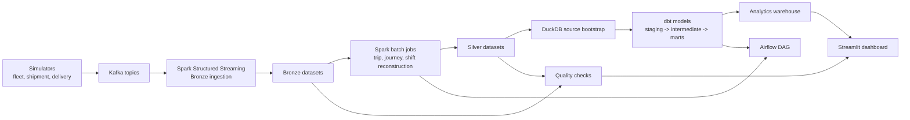

# Unified Logistics Data Platform

A modern logistics data platform: Streamlit dashboard backed by a Bronze/Silver/Gold lakehouse modeled in dbt, with a Spark + Kafka + Airflow live path for the full architecture walkthrough.

## Live Demo

- Hosted demo: _coming soon_ (the Render service URL will be added here once it is deployed).
- Local demo screenshot: see [docs/DEMO.md](docs/DEMO.md).

## Deploy To Render

The dashboard ships with a free-tier Render Blueprint. One click stands up the Streamlit app from this repo:

[](https://render.com/deploy?repo=https://github.com/udaymukhija3/logistics-data-engineering)

The Blueprint builds the `dashboard` stage of the [Dockerfile](Dockerfile), runs Streamlit on Render's injected `$PORT`, and serves the bundled sample dataset (no external database required).

## Run Locally In One Command

You only need Docker. From a fresh clone:

```bash
git clone https://github.com/udaymukhija3/logistics-data-engineering.git
cd logistics-data-engineering
docker build --target dashboard -t logistics-dashboard . \
  && docker run --rm -p 8501:8501 logistics-dashboard
```

Then open [http://localhost:8501](http://localhost:8501). The image bundles `data/sample/` so the dashboard renders real Bronze and Silver datasets immediately. No `.env` file is required for the demo path.

If you prefer a Python virtualenv instead of Docker, see the [Recommended Local Verification](#recommended-local-verification) section below.

---

If you are here to kick the tires locally, start with the recommended verification path below. It is the fastest way to prove that the repo is healthy end to end without first standing up Kafka, Spark cluster mode, and Airflow.

This project models a modern logistics data platform across three operational surfaces:

- Fleet telematics
- Shipment tracking
- Last-mile delivery

The point of the repo is not just to show a few isolated scripts. The point is to show how a data platform holds together when event generation, streaming ingestion, batch reconstruction, warehouse modeling, quality controls, orchestration, and a human-facing dashboard all share the same contracts.

## What This Product Actually Does

At a high level, the platform simulates logistics operations, lands those events into a Bronze layer, reconstructs operational entities in Silver, models analytics-ready facts and dimensions in dbt, validates data quality, and surfaces the result in Streamlit.

The three business domains are modeled like this:

- **Fleet telematics**: vehicle GPS pings, telemetry, and driving alerts become reconstructed trips and driver-level performance analytics.
- **Shipment tracking**: shipment lifecycle scans move through hubs and delivery states, then become shipment journey facts, hub throughput analytics, and SLA monitoring.
- **Last-mile delivery**: agent positions and delivery outcomes become shift-level productivity metrics, zone-level performance, and customer experience signals.

Under the hood, the repo includes:

- Kafka topics for six operational event streams
- Spark Structured Streaming for Bronze ingestion
- Spark batch jobs for trip, journey, and shift reconstruction
- dbt models for a star-schema warehouse in DuckDB
- A custom quality framework plus dbt tests
- DuckDB-backed run metadata for quality runs and dataset snapshots
- An Airflow DAG that wires the batch and analytics flow together
- A Streamlit dashboard that works in both live and sample-data modes

## Two Ways To Run The Repo

There are really two valid ways to experience this codebase.

| Mode | What it proves | Docker required | Recommended for |
| --- | --- | --- | --- |
| Sample mode | Deterministic local verification of contracts, dbt models, tests, quality checks, and dashboard behavior | No | First run, interviews, quick evaluation |
| Live mode | The full moving-parts experience with Kafka, Spark, Airflow, and local infrastructure | Yes | Deeper architecture walkthroughs |

Sample mode is the best first stop because it gives you a strong signal quickly and avoids confusing infrastructure issues before you have seen the product.

## Architecture At A Glance



## Data Layers

| Layer | Example datasets | Why it exists |
| --- | --- | --- |
| Bronze | `vehicle_positions`, `vehicle_telemetry`, `shipment_events`, `agent_positions`, `delivery_events`, `alerts` | Preserve event-level detail with contract alignment and ingestion metadata |
| Silver | `trips`, `journeys`, `agent_shifts`, `zone_performance` | Reconstruct higher-level operational entities and business-ready metrics |
| Gold / marts | `fct_trips`, `fct_driver_performance`, `fct_shipments`, `fct_hub_daily`, `fct_agent_daily`, `fct_zone_daily`, `dim_hubs`, `dim_time` | Serve analytics and dashboard queries with stable grains and business semantics |

## Recommended Local Verification

This is the path I would hand to another engineer first.

### 1. Prerequisites

- Python 3.10+
- `pip`
- Java 11+ only if you want to exercise Spark paths
- Docker Desktop only if you want the full live stack

Note:

- The Makefile uses `docker-compose`, not `docker compose`.
- If you run scripts directly instead of through `make`, set `PYTHONPATH` to the repo root first.

### 2. Create an environment

```bash
git clone <your-repo-url>
cd logistics

python3 -m venv venv
source venv/bin/activate
python -m pip install --upgrade pip
pip install -r requirements.txt

export PYTHONPATH="$PWD"
export LOGISTICS_DUCKDB_PATH="$PWD/data/warehouse/logistics.duckdb"
```

You do not need `.env` for the sample-mode verification flow.

### 3. Build the verified demo path

```bash
make demo-build
```

What this does:

- Rebuilds the canonical sample datasets under `data/sample`
- Bootstraps DuckDB source views from that sample bundle
- Runs the dbt warehouse build and tests
- Refreshes the quality report for the sample bundle
- Records run metadata in `ops.pipeline_runs` and `ops.dataset_snapshots`

If you prefer to run each step manually instead of using the Make target:

```bash
python scripts/generate_sample_data.py

python scripts/bootstrap_duckdb_sources.py \
  --data-path data \
  --db-path "$LOGISTICS_DUCKDB_PATH" \
  --mode sample

dbt build --project-dir dbt_logistics --profiles-dir dbt_logistics

python -m src.quality.quality_checks \
  --layer all \
  --data-path data/sample \
  --output-path data/sample/quality_reports \
  --db-path "$LOGISTICS_DUCKDB_PATH"
```

### 4. Launch the demo UI

```bash
make demo
```

Then open [http://localhost:8501](http://localhost:8501).

If you want to launch the UI without rebuilding first:

```bash
make dashboard DASHBOARD_DATA_MODE=sample
```

The default frontend is now a minimal read-only demo surface built for interviews and portfolio walkthroughs. It uses one explicit data root at a time. `sample` reads from `data/sample`, `live` prefers `data/live` when present, and `auto` only switches to live when the core Bronze datasets actually exist.

If you want the older exploratory dashboard instead of the minimal demo surface:

```bash
make dashboard-legacy DASHBOARD_DATA_MODE=sample
```

For the short walkthrough script, see [docs/DEMO.md](docs/DEMO.md).

### 5. What success looks like

As of **April 7, 2026**, the repo verified locally with these results:

- `python scripts/generate_sample_data.py` rebuilt the sample bundle and reported `31/31` quality checks passed
- `pytest -q` passed with `92` tests
- `dbt build --project-dir dbt_logistics --profiles-dir dbt_logistics` completed successfully
- `python -m src.quality.quality_checks --layer all --data-path data/sample` passed `31/31` checks and recorded a quality run in `ops.pipeline_runs`

Those exact counts may change as the repo evolves. The real signal is that the sample bundle rebuilds cleanly, tests pass, dbt builds cleanly, and the quality run stays green.

## Full Live-Stack Walkthrough

If you want the full infrastructure path, this is the sequence.

### 1. Configure environment variables

```bash
cp .env.example .env
```

Before bringing up infrastructure, set at least these values in `.env`:

- `POSTGRES_PASSWORD`
- `MINIO_ROOT_USER`
- `MINIO_ROOT_PASSWORD`
- `AIRFLOW__CORE__FERNET_KEY`
- `AIRFLOW_ADMIN_PASSWORD`

Recommended live defaults:

- keep `LOGISTICS_STORAGE_FORMAT=parquet` for the most reproducible local run
- leave `SPARK_MASTER=spark://spark-master:7077` so Airflow and local commands point at the same cluster
- keep `LOGISTICS_DATA_ROOT=/opt/logistics/data/live` so live outputs stay isolated from the sample bundle

### 2. Start infrastructure

```bash
make setup
source venv/bin/activate
make infra-up
```

That brings up:

- a single-node local Kafka broker
- Spark master and worker
- Postgres

If you want the optional operator surfaces too:

```bash
make infra-up-full
```

That additionally starts:

- Kafka UI
- MinIO
- Airflow with a custom image that includes PySpark, dbt, and the repo Python dependencies

### 3. Start streaming ingestion

Use a separate terminal:

```bash
make stream
```

`make stream` now submits the job from inside the Docker Spark master container. You do not need a host `spark-submit` installation anymore.
It writes Bronze data to `data/live/bronze` and checkpoints to `data/live/checkpoints`.

### 4. Generate live events

Use another terminal:

```bash
make simulate-demo
```

If you want more targeted domain testing:

```bash
make simulate-fleet
make simulate-shipments
make simulate-delivery
```

### 5. Run batch processing

After Bronze data has landed:

```bash
make batch
```

`make batch` now submits all three batch jobs into the Docker Spark cluster and defaults to partitioned parquet outputs for rerun-safe local backfills.
For a single-date replay, use:

```bash
make backfill-live PROCESSING_DATE=YYYY-MM-DD
```

`make batch-local` remains a development shortcut, not the canonical live path. It assumes a local PySpark runtime and is mainly for debugging one machine at a time.

### 6. Build analytics and run checks

```bash
make live-demo-build

make quality-live
```

If you want Airflow to orchestrate the same live path, trigger `logistics_daily_batch_processing` after Bronze data exists. The DAG now:

- checks that live Bronze parquet files are present
- runs the three PySpark batch jobs against the shared Spark master
- bootstraps DuckDB in `live` mode
- runs one `dbt build`
- writes one full quality report under `data/live/quality_reports`
- records run metadata into the local DuckDB warehouse

### 7. Open the dashboard

```bash
make live-demo
```

## Local Endpoints

When the full stack is running, these are the main URLs:

- Dashboard: [http://localhost:8501](http://localhost:8501)
- Airflow: [http://localhost:8080](http://localhost:8080)
- Kafka UI: [http://localhost:8090](http://localhost:8090)
- Spark Master UI: [http://localhost:8081](http://localhost:8081)
- MinIO Console: [http://localhost:9001](http://localhost:9001)

Credentials are driven by `.env`.

For Airflow, the username is `admin` and the password is whatever you set in `AIRFLOW_ADMIN_PASSWORD`.

## What You Can Explore In The Dashboard

The Streamlit app is a read-only operator and demo surface, not just a screenshot page.

- **Overview**: warehouse KPIs, selected data root, mart previews, and fleet footprint
- **Pipeline Status**: parquet inventories, mart counts, and latest quality status
- **Warehouse Explorer**: direct previews of built DuckDB marts and dimensions
- **Fleet Telematics**: GPS volume, speed patterns, reconstructed trips, and driving behavior
- **Shipment Tracking**: shipment lifecycle distribution, hub activity, journey states, and SLA compliance
- **Last-Mile Delivery**: delivery success, agent productivity, zone performance, and customer ratings
- **Data Quality**: latest quality run summary and check-level detail
- **Architecture**: the intended full-stack design plus the smaller verified demo path

## Warehouse Design

The dbt project is intentionally shaped like something an analytics engineer or BI consumer could use immediately.

Core marts:

- `fct_trips`: one row per trip
- `fct_driver_performance`: one row per driver per day
- `fct_shipments`: one row per shipment
- `fct_hub_daily`: one row per hub per day
- `fct_agent_daily`: one row per agent per day
- `fct_zone_daily`: one row per zone per day
- `dim_time`: date dimension
- `dim_hubs`: hub dimension

Some of the modeled business questions this answers:

- Which vehicles or drivers are generating inefficient routes?
- Which shipment journeys are breaching SLA, and where are they stalling?
- Which hubs are becoming throughput bottlenecks?
- Which delivery zones are underperforming on success rate or customer satisfaction?
- Which agents are delivering quickly but creating avoidable failed attempts?

## Repo Layout

```text
src/
  batch/              Spark batch jobs
  dashboard/          Streamlit application
  domain/             Shared domain constants
  quality/            Data quality framework
  simulators/         Event generators and orchestrator
  streaming/          Kafka -> Bronze ingestion
  utils/              Shared helpers

dbt_logistics/        dbt project
dags/                 Airflow DAGs
infrastructure/       Docker Compose and infra scripts
data/sample/          Canonical sample datasets
scripts/              Utility scripts for sample generation and DuckDB bootstrap
tests/                Unit and integration tests
```

## Helpful Notes Before You Lose 20 Minutes

- If you run `dbt` directly, export `LOGISTICS_DUCKDB_PATH` first. The profile falls back to a relative path that is easy to misread from the repo root.
- If you are verifying the sample bundle, run quality against `data/sample`, not `data/`. The `data/` root is meant for live pipeline outputs.
- The live path is isolated under `data/live`. Do not point dbt or quality at `data/` unless you intentionally want root-level live outputs.
- `scripts/generate_sample_data.py` already performs a quality run as part of the sample bundle build.
- `scripts/bootstrap_duckdb_sources.py` accepts `--mode sample|live|auto`. Use `sample` for the canonical demo and avoid mixing sample and live parquet roots in one build.
- `make demo-build` and `make dashboard` work from an activated `venv`, but they also work from an already-prepared shell now. A missing `venv/` no longer blocks the verified local path.
- `make stream` and `make batch` use the Docker Spark cluster by default. That is intentional. It keeps the live path honest and avoids hidden host dependencies.
- The demo UI now prefers metadata from `ops.pipeline_runs` when available, and falls back to quality artifacts only if metadata has not been recorded yet.

## Additional Documentation

- `DE_PROJECT_BRIEF.md`
- `DE_CASE_STUDY.md`
- [docs/RUNBOOK.md](docs/RUNBOOK.md)
- [docs/ARCHITECTURE.md](docs/ARCHITECTURE.md)
- [docs/PRODUCTIZATION_PLAN.md](docs/PRODUCTIZATION_PLAN.md)
- `docs/logistics_platform_blueprint_part1.md`
- `docs/logistics_platform_blueprint_part2.md`
- `docs/logistics_platform_blueprint_part3.md`

## License

MIT License.
