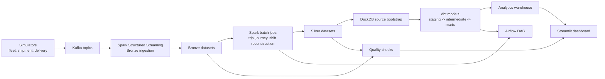

# Unified Logistics Data Platform

A modern logistics data platform: Streamlit dashboard backed by a Bronze/Silver/Gold lakehouse modeled in dbt, with a Spark + Kafka + Airflow live path for the full architecture walkthrough.

## Live Demo

- Recruiter overview: the static portfolio site is in [site/](site/) and has
  been pushed to the `gh-pages` branch. Enable GitHub Pages for that branch to
  publish it at `https://udaymukhija3.github.io/logistics-data-engineering/`.
- Hosted Streamlit app: _coming soon_ — the Render service URL is added here once the Blueprint deploys.
- Walkthrough script: see [docs/DEMO.md](docs/DEMO.md).

## Deploy In One Click

The dashboard ships with three zero-config deploy paths. Each serves the bundled `data/sample/` dataset, so no external database is required.

### Recruiter overview (static)

The [portfolio site](site/index.html) gives recruiters a fast project overview,
dashboard preview, proof metrics, CI link, and deploy paths without requiring
the Streamlit runtime to be awake. For the permanent public URL, enable GitHub
Pages from the `gh-pages` branch in the repository settings.

### Render (Docker, free tier)

[](https://render.com/deploy?repo=https://github.com/udaymukhija3/logistics-data-engineering)

The Blueprint at [render.yaml](render.yaml) builds the `dashboard` stage of the [Dockerfile](Dockerfile), runs Streamlit on Render's injected `$PORT`, and uses `/_stcore/health` for liveness checks.

### Streamlit Community Cloud (Python only)

1. Push this repo to GitHub.
2. On <https://streamlit.io/cloud> click **New app** and select the repo.
3. Set **Main file path** to `streamlit_app.py` and **Requirements file** to `requirements-streamlit.txt`.

[streamlit_app.py](streamlit_app.py) is a thin shim that forwards to the same `src/dashboard/app.py` used by the Docker deploy.

### Docker locally

```bash
git clone https://github.com/udaymukhija3/logistics-data-engineering.git
cd logistics-data-engineering
docker build --target dashboard -t logistics-dashboard . \
  && docker run --rm -p 8501:8501 logistics-dashboard
```

Or via the Makefile shortcut:

```bash
make dashboard-docker
```

Then open <http://localhost:8501>. No `.env` file or external service is required.

If you prefer a Python virtualenv, see [Recommended Local Verification](#recommended-local-verification) below.

---

If you are here to kick the tires locally, start with the recommended verification path below. It is the fastest way to prove that the repo is healthy end to end without first standing up Kafka, Spark cluster mode, and Airflow.

This project models a modern logistics data platform across three operational surfaces:

- Fleet telematics
- Shipment tracking
- Last-mile delivery

The point of the repo is not just to show a few isolated scripts. The point is to show how a data platform holds together when event generation, streaming ingestion, batch reconstruction, warehouse modeling, quality controls, orchestration, and a human-facing dashboard all share the same contracts.

## What This Product Actually Does

At a high level, the platform simulates logistics operations, lands those events into a Bronze layer, reconstructs operational entities in Silver, models analytics-ready facts and dimensions in dbt, validates data quality, and surfaces the result in Streamlit.

The three business domains are modeled like this:

- **Fleet telematics**: vehicle GPS pings, telemetry, and driving alerts become reconstructed trips and driver-level performance analytics.
- **Shipment tracking**: shipment lifecycle scans move through hubs and delivery states, then become shipment journey facts, hub throughput analytics, and SLA monitoring.
- **Last-mile delivery**: agent positions and delivery outcomes become shift-level productivity metrics, zone-level performance, and customer experience signals.

Under the hood, the repo includes:

- Kafka topics for six operational event streams
- Spark Structured Streaming for Bronze ingestion
- Spark batch jobs for trip, journey, and shift reconstruction
- dbt models for a star-schema warehouse in DuckDB
- A custom quality framework plus dbt tests
- DuckDB-backed run metadata for quality runs and dataset snapshots
- An Airflow DAG that wires the batch and analytics flow together
- A Streamlit dashboard that works in both live and sample-data modes

## Two Ways To Run The Repo

There are really two valid ways to experience this codebase.

| Mode | What it proves | Docker required | Recommended for |
| --- | --- | --- | --- |
| Sample mode | Deterministic local verification of contracts, dbt models, tests, quality checks, and dashboard behavior | No | First run, interviews, quick evaluation |
| Live mode | The full moving-parts experience with Kafka, Spark, Airflow, and local infrastructure | Yes | Deeper architecture walkthroughs |

Sample mode is the best first stop because it gives you a strong signal quickly and avoids confusing infrastructure issues before you have seen the product.

## Architecture At A Glance



## Data Layers

| Layer | Example datasets | Why it exists |
| --- | --- | --- |
| Bronze | `vehicle_positions`, `vehicle_telemetry`, `shipment_events`, `agent_positions`, `delivery_events`, `alerts` | Preserve event-level detail with contract alignment and ingestion metadata |
| Silver | `trips`, `journeys`, `agent_shifts`, `zone_performance` | Reconstruct higher-level operational entities and business-ready metrics |
| Gold / marts | `fct_trips`, `fct_driver_performance`, `fct_shipments`, `fct_hub_daily`, `fct_agent_daily`, `fct_zone_daily`, `dim_hubs`, `dim_time` | Serve analytics and dashboard queries with stable grains and business semantics |

## Recommended Local Verification

This is the path I would hand to another engineer first.

### 1. Prerequisites

- Python 3.10+
- `pip`
- Java 11+ only if you want to exercise Spark paths
- Docker Desktop only if you want the full live stack

Note:

- The Makefile uses Docker Compose v2 (`docker compose`) for infrastructure checks.
- If you run scripts directly instead of through `make`, set `PYTHONPATH` to the repo root first.

### 2. Create an environment

```bash
git clone <your-repo-url>
cd logistics

python3 -m venv venv
source venv/bin/activate
python -m pip install --upgrade pip
pip install -r requirements.txt

export PYTHONPATH="$PWD"
export LOGISTICS_DUCKDB_PATH="$PWD/data/warehouse/logistics.duckdb"
```

You do not need `.env` for the sample-mode verification flow.

### 3. Build the verified demo path

```bash
make demo-build
```

What this does:

- Rebuilds the canonical sample datasets under `data/sample`
- Bootstraps DuckDB source views from that sample bundle
- Runs the dbt warehouse build and tests
- Refreshes the quality report for the sample bundle
- Records run metadata in `ops.pipeline_runs` and `ops.dataset_snapshots`

If you prefer to run each step manually instead of using the Make target:

```bash
python scripts/generate_sample_data.py

python scripts/bootstrap_duckdb_sources.py \
  --data-path data/sample \
  --db-path "$LOGISTICS_DUCKDB_PATH"

dbt build --project-dir dbt_logistics --profiles-dir dbt_logistics

python -m src.quality.quality_checks \
  --layer all \
  --data-path data/sample \
  --output-path data/sample/quality_reports
```

### 4. Launch the demo UI

```bash
make dashboard
```

Then open [http://localhost:8501](http://localhost:8501).

The dashboard auto-detects whether `data/live/` parquet files exist. If they do, it uses live data; otherwise it falls back to the bundled `data/sample/` snapshot. There is no separate "sample mode" toggle.

For the short walkthrough script, see [docs/DEMO.md](docs/DEMO.md).

### 5. What success looks like

The verified local run produces these results from a clean clone:

- `python scripts/generate_sample_data.py` rebuilds the sample bundle and reports `31/31` quality checks passed.
- `make demo-build` runs the full sample-mode build (sample bundle, DuckDB bootstrap, `dbt build`, quality run) green end to end.
- `dbt build` reports `PASS=80, ERROR=0` across 13 table models, 6 view models, and 59 data tests.
- `python -m src.quality.quality_checks --layer all --data-path data/sample` passes `31/31` checks and writes a JSON report under `data/sample/quality_reports/`.
- `pytest tests/` passes the bundled unit and integration suites.

Those exact counts may evolve. The signal that matters is that `make demo-build` finishes cleanly and `make dashboard` renders every page without warnings.

## Full Live-Stack Walkthrough

If you want the full infrastructure path, this is the sequence.

### 1. Configure environment variables

```bash
cp .env.example .env
```

Before bringing up infrastructure, set at least these values in `.env`:

- `POSTGRES_PASSWORD`
- `MINIO_ROOT_USER`
- `MINIO_ROOT_PASSWORD`
- `AIRFLOW__CORE__FERNET_KEY`
- `AIRFLOW_ADMIN_PASSWORD`

Recommended live defaults:

- keep `LOGISTICS_STORAGE_FORMAT=parquet` for the most reproducible local run
- leave `SPARK_MASTER=spark://spark-master:7077` so Airflow and local commands point at the same cluster
- keep `LOGISTICS_DATA_ROOT=/opt/logistics/data/live` so live outputs stay isolated from the sample bundle

### 2. Start infrastructure

```bash
make setup
source venv/bin/activate
make infra-up
```

That brings up:

- a single-node local Kafka broker
- Spark master and worker
- Postgres

### 3. Start streaming ingestion

Use a separate terminal:

```bash
make stream
```

`make stream` runs the Spark Structured Streaming job that consumes Kafka topics and writes Bronze parquet datasets to `data/bronze/` with checkpoints in `data/checkpoints/`. It assumes Spark is reachable on the configured `SPARK_MASTER`.

### 4. Generate live events

Use another terminal:

```bash
make simulate-demo
```

For more targeted domain testing:

```bash
make simulate-fleet
make simulate-shipments
make simulate-delivery
```

### 5. Run batch processing

After Bronze data has landed:

```bash
make batch
```

`make batch` runs trip reconstruction, journey reconstruction, and agent shift aggregation against the shared Spark master and writes Silver outputs under `data/silver/`. `make batch-local` is the in-process PySpark shortcut for debugging on one machine.

### 6. Build analytics and run checks

```bash
make dbt-build

make quality
```

If you want Airflow to orchestrate the same live path, trigger `logistics_daily_batch_processing` after Bronze data exists. The DAG runs the three PySpark batch jobs, bootstraps DuckDB, runs `dbt build`, and writes a quality report.

### 7. Open the dashboard

```bash
make dashboard
```

The dashboard auto-detects live data: if `data/bronze/` and `data/silver/` contain parquet files it uses those; otherwise it falls back to the bundled `data/sample/`.

## Local Endpoints

When the full stack is running, these are the main URLs:

- Dashboard: [http://localhost:8501](http://localhost:8501)
- Airflow: [http://localhost:8080](http://localhost:8080)
- Kafka UI: [http://localhost:8090](http://localhost:8090)
- Spark Master UI: [http://localhost:8081](http://localhost:8081)
- MinIO Console: [http://localhost:9001](http://localhost:9001)

Credentials are driven by `.env`.

For Airflow, the username is `admin` and the password is whatever you set in `AIRFLOW_ADMIN_PASSWORD`.

## What You Can Explore In The Dashboard

The Streamlit app is a read-only operator and demo surface, not just a screenshot page. Six pages are available from the sidebar:

- **Overview**: platform snapshot, service-level KPIs, pipeline coverage, and the geospatial fleet footprint
- **Fleet Telematics**: GPS volume, speed patterns, reconstructed trips, and driving behavior
- **Shipment Tracking**: shipment lifecycle distribution, hub activity, journey outcomes, and SLA compliance
- **Last-Mile Delivery**: delivery success, agent productivity, zone performance, and customer ratings
- **Data Quality**: latest quality run summary and check-level detail
- **Architecture**: the technology stack, star-schema design, and medallion layout

## Warehouse Design

The dbt project is intentionally shaped like something an analytics engineer or BI consumer could use immediately.

Core marts:

- `fct_trips`: one row per trip
- `fct_driver_performance`: one row per driver per day
- `fct_shipments`: one row per shipment
- `fct_hub_daily`: one row per hub per day
- `fct_agent_daily`: one row per agent per day
- `fct_zone_daily`: one row per zone per day
- `dim_time`: date dimension
- `dim_hubs`: hub dimension

Some of the modeled business questions this answers:

- Which vehicles or drivers are generating inefficient routes?
- Which shipment journeys are breaching SLA, and where are they stalling?
- Which hubs are becoming throughput bottlenecks?
- Which delivery zones are underperforming on success rate or customer satisfaction?
- Which agents are delivering quickly but creating avoidable failed attempts?

## Repo Layout

```text
src/
  batch/              Spark batch jobs
  dashboard/          Streamlit application
  domain/             Shared domain constants
  quality/            Data quality framework
  simulators/         Event generators and orchestrator
  streaming/          Kafka -> Bronze ingestion
  utils/              Shared helpers

dbt_logistics/        dbt project
dags/                 Airflow DAGs
infrastructure/       Docker Compose and infra scripts
data/sample/          Canonical sample datasets
scripts/              Utility scripts for sample generation and DuckDB bootstrap
tests/                Unit and integration tests
```

## Helpful Notes Before You Lose 20 Minutes

- If you run `dbt` directly, export `LOGISTICS_DUCKDB_PATH` first. The profile falls back to a relative path that is easy to misread from the repo root.
- If you are verifying the sample bundle, run quality against `data/sample`, not `data/`. The `data/` root is meant for live pipeline outputs.
- `scripts/generate_sample_data.py` already performs a quality run as part of the sample bundle build, so a green run there means the bundle is healthy.
- `scripts/bootstrap_duckdb_sources.py` auto-detects whether the supplied `--data-path` contains a top-level `bronze/silver` layout or a `sample/` subdirectory. Point it at `data/sample` for the demo build.
- `make demo-build` and `make dashboard` work from an activated `venv`, but they also work from any shell that already has the deps installed. A missing `venv/` no longer blocks the verified local path.
- The dashboard auto-selects sample vs. live data by looking for parquet files under `data/bronze/` and `data/silver/`; sample is the fallback. There is no separate "mode" environment variable.

## Additional Documentation

- [docs/DEMO.md](docs/DEMO.md) — the 5-minute walkthrough script
- `DE_PROJECT_BRIEF.md` — short project brief
- `DE_CASE_STUDY.md` — long-form case study
- `docs/logistics_platform_blueprint_part1.md` — executive overview and architecture
- `docs/logistics_platform_blueprint_part2.md` — data model, contracts, transformations
- `docs/logistics_platform_blueprint_part3.md` — orchestration, quality, ops

## License

MIT License.
